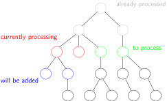

# CUDA Enumeration Idea

In this part, we describe how the enumeration algorithm is parallelized on Cuda Blocks and Threads.

## CUDA Blocks vs Warps vs Threads 

In Cuda, functionality is distributed between the "host" (CPU) and the "device" (GPU). Usually, the host prepares the input,
and then starts many threads executing the same function on the device. These threads are grouped into a hierarchy
 - 32 threads are grouped into a warp. All threads in a warp are executed synchronously, so they always execute the same instruction. Branching within a warp is bad for performance.
 - Up to 32 warps form a block. Within a block, synchronization is possible via barriers.
 - All blocks form the grid that is executed on the device. Classically, grid synchronization is only possible by calling and joining multiple functions on the host.
In addition to avoiding branches on warp level, memory accesses should also be aligned on warp level (i.e. all threads in a warp should address subsequent words in memory).

## Enumeration tree

In principle, given a triangular basis of a rank n lattice L (usually the gram-schmidt coefficients), enumeration is a tree search:

The nodes on level i in the tree are given by all points with norm less than some given limit in the projection of L into the subspace Un-i, defined as the space perpendicular to the first n-i basis vectors. Therefore, the root of the tree is only the origin. The children of a node at level i are now given by all points in the projection of L into Un-i-1 whose projection into Un-i is the parent point.

## The search

If each Cuda thread performed a simple depth-first search independent of each other, this would lead very inefficient branching and memory accesses. Instead, a hybrid between depth-first search of the tree and breadth-first search is chosen:

Each thread block works independently, but within a thread block, there is always a list of nodes whose subtrees have yet to be searched. In each step, each thread gets one of these buffer nodes assigned, and calculates its children, which are again added to the list. In contrast to the standard breadth-first search however, open nodes at the downmost tree level are processed first, so that we find first solutions as fast as possible, and to prevent huge list sizes. For efficiency reasons, all threads always work on nodes on the same level, and the open nodes are stored individually for each level.

